---

My collection of presentations, articles, audio, and videos accumulated over the years.
Feel free to explore and learn — but if you use this content, please **give credit where it's due**.
All content is copyrighted by me, and where applicable, the original authors I borrowed from and credited.

**Many Thanks — Mike** &nbsp;·&nbsp; [mikenelson.io](https://mikenelson.io)

---

## `// Annual Archives`

Presentations, demos, and session content organized by year.

| Year | Archive |
|------|---------|
| 📁 **2025** | [Browse →](https://github.com/mikenelson-io/MyPresentations/tree/main/2025) |
| 📁 **2024** | [Browse →](https://github.com/mikenelson-io/MyPresentations/tree/main/2024) |
| 📁 **2023** | [Browse →](https://github.com/mikenelson-io/MyPresentations/tree/main/2023) |
| 📁 **2022** | [Browse →](https://github.com/mikenelson-io/MyPresentations/tree/main/2022) |
| 📁 **2021** | [Browse →](https://github.com/mikenelson-io/MyPresentations/tree/main/2021) |
| 📁 **2020** | [Browse →](https://github.com/mikenelson-io/MyPresentations/tree/main/2020) |
| 📁 **2019** | [Browse →](https://github.com/mikenelson-io/MyPresentations/tree/main/2019) |
| 📁 **2018** | [Browse →](https://github.com/mikenelson-io/MyPresentations/tree/main/2018) |
| 📁 **2017** | [Browse →](https://github.com/mikenelson-io/MyPresentations/tree/main/2017) |
| 📁 **2016** | [Browse →](https://github.com/mikenelson-io/MyPresentations/tree/main/2016) |
| 📁 **2015** | [Browse →](https://github.com/mikenelson-io/MyPresentations/tree/main/2015) |
| 📁 **2014** | [Browse →](https://github.com/mikenelson-io/MyPresentations/tree/main/2014) |
| 📁 **2013** | [Browse →](https://github.com/mikenelson-io/MyPresentations/tree/main/2013) |
| 📁 **2012** | [Browse →](https://github.com/mikenelson-io/MyPresentations/tree/main/2012) |
| 📁 **2011** | [Browse →](https://github.com/mikenelson-io/MyPresentations/tree/main/2011) |
| 📁 **2010** | [Browse →](https://github.com/mikenelson-io/MyPresentations/tree/main/2010) |
| 📁 **2009** | [Browse →](https://github.com/mikenelson-io/MyPresentations/tree/main/2009) |

---

## `// Topic Collections`

| Collection | Description |
|------------|-------------|
| 📄 [**Articles & Papers**](https://github.com/mikenelson-io/MyPresentations/tree/main/Articles%20and%20Papers) | Written works, technical articles, and research papers |
| 🎓 [**Citrix Learning Author Credit**](https://github.com/mikenelson-io/MyPresentations/tree/main/Citrix%20Learning%20Author%20Credit) | Official Citrix authored training and learning content |
| 🚀 [**MVPDays Presentations**](https://github.com/mikenelson-io/MyPresentations/tree/main/MVPDays%20presentations) | Talks and sessions delivered at MVPDays events |

---

## `// Connect`

| Platform | Link |
|----------|------|
| 🌐 Website | [mikenelson.io](https://mikenelson.io) |
| ▶️ YouTube | [Presentations Playlist](https://www.youtube.com/playlist?list=PLveSed1MaJkTb5imGwYVJeounfiB5sbfw) |
| 🐙 GitHub | [mikenelson-io](https://github.com/mikenelson-io) |

---

© Mike Nelson · All content copyrighted by respective authors · MIT License

